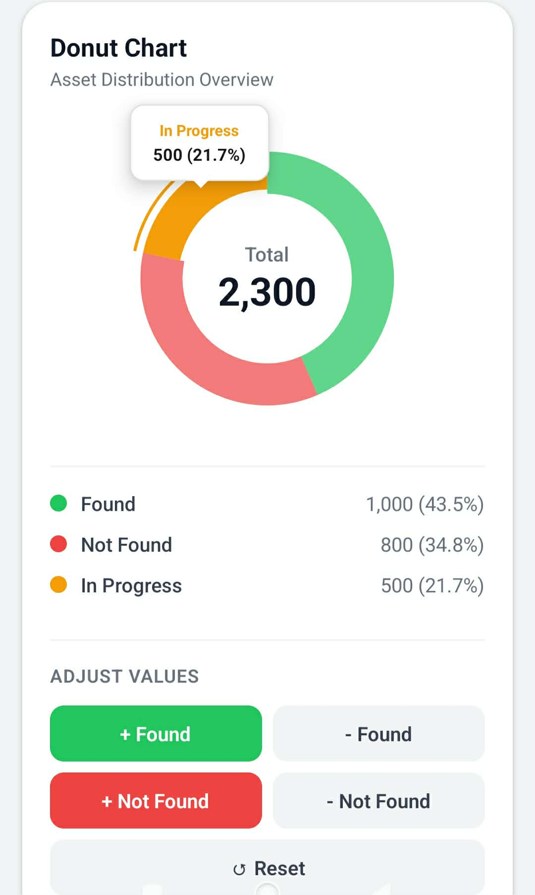
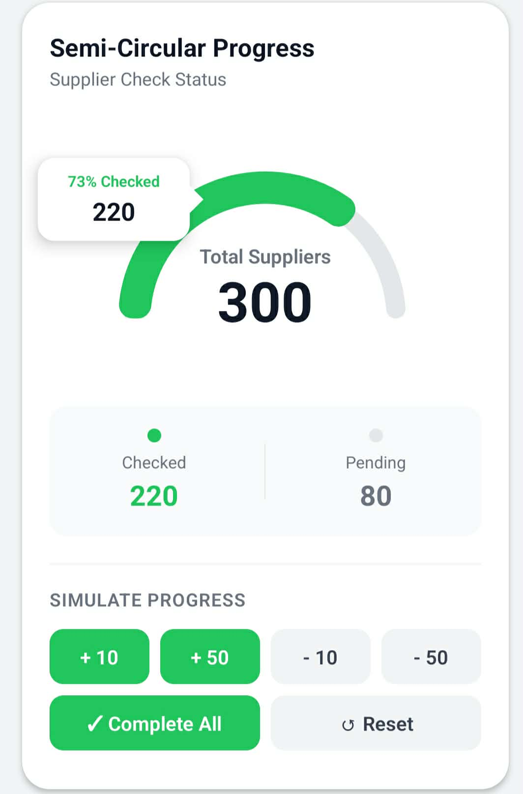

# React Native Chart Libraries

Custom chart components for React Native with animations, tooltips, and customization options.

## Screenshots

<p align="center">
  
  
</p>

---

## Overview

This project includes custom-built chart libraries for React Native:

| Library | Description |
|---------|-------------|
| [PieChart](#piechart) | Pie/Donut chart with animations and tooltips |
| [SemiCircularProgress](#semicircularprogress) | Semi-circular progress chart for displaying progress |

## Installation

```bash
# Install dependencies
npm install d3-shape react-native-svg

# Start the app
npx expo start
```

---

## Libraries

### PieChart

Pie/Donut Chart component with animation, tooltip, and customization options.

📁 **Location:** `libs/PieChart/`

#### Features

- ✅ Pie Chart and Donut Chart
- ✅ Animation with easing functions (linear, easeIn, easeOut, easeInOut)
- ✅ Sequential animation for slices
- ✅ Interactive speech bubble tooltips
- ✅ Custom tooltip content / Full custom tooltip
- ✅ Center label or custom children content
- ✅ Outer border customization
- ✅ Selection scale animation
- ✅ Debug mode
- ✅ Press callbacks

#### Quick Start

```tsx
import PieChart, { Slice } from './libs/PieChart';

const data: Slice[] = [
  { value: 300, color: '#22C55E', label: { text: 'Success' } },
  { value: 150, color: '#F59E0B', label: { text: 'Warning' } },
  { value: 50, color: '#EF4444', label: { text: 'Error' } },
];

<PieChart
  widthAndHeight={250}
  series={data}
  cover={0.6}  // Donut hole (0-1)
  animation={{
    enabled: true,
    duration: 800,
    easing: 'easeOut',
  }}
>
  <View style={{ alignItems: 'center' }}>
    <Text>Total</Text>
    <Text style={{ fontSize: 24, fontWeight: 'bold' }}>500</Text>
  </View>
</PieChart>
```

#### Props

| Prop | Type | Default | Description |
|------|------|---------|-------------|
| `widthAndHeight` | `number` | **required** | Size of the chart |
| `series` | `Slice[]` | **required** | Data for each slice |
| `cover` | `number \| Cover` | - | Donut hole radius (0-1) |
| `animation` | `boolean \| AnimationConfig` | `true` | Animation settings |
| `showTooltip` | `boolean` | `true` | Show tooltip on press |
| `tooltipDelay` | `number` | `3000` | Auto-hide delay (ms) |
| `centerLabel` | `CenterLabelConfig` | - | Center label configuration |
| `children` | `ReactNode` | - | Custom center content |
| `debug` | `boolean` | `false` | Debug mode |

📖 **Full Documentation:** [libs/PieChart/README.md](libs/PieChart/README.md)

---

### SemiCircularProgress

Semi-circular progress chart for displaying progress in a half-circle format.

📁 **Location:** `libs/SemiCircularProgress/`

#### Features

- ✅ Semi-circular (180°) progress chart
- ✅ Multiple segments with different thickness
- ✅ Progress animation (draws background first, then animates progress)
- ✅ Custom corner radius (start/end separately)
- ✅ Interactive speech bubble tooltips
- ✅ Custom tooltip content / Full custom tooltip
- ✅ Center content (config or render function)
- ✅ Debug mode
- ✅ Press callbacks

#### Quick Start

```tsx
import SemiCircularProgress from './libs/SemiCircularProgress';

<SemiCircularProgress
  width={300}
  height={200}
  segments={[
    {
      value: 220,
      color: '#22C55E',
      label: '220',
      sublabel: '73% Checked',
      thicknessMultiplier: 1.0,
    },
    {
      value: 80,
      color: '#E5E7EB',
      label: '80',
      sublabel: 'In Progress',
      thicknessMultiplier: 0.6,
    },
  ]}
  thickness={0.22}
  animation={{
    enabled: true,
    duration: 800,
    easing: 'easeOut',
  }}
>
  {({ total, animationProgress }) => (
    <View style={{ alignItems: 'center' }}>
      <Text>Total Suppliers</Text>
      <Text style={{ fontSize: 40, fontWeight: 'bold' }}>
        {Math.round(total * animationProgress)}
      </Text>
    </View>
  )}
</SemiCircularProgress>
```

#### Props

| Prop | Type | Default | Description |
|------|------|---------|-------------|
| `width` | `number` | **required** | Width of the component |
| `height` | `number` | **required** | Height of the component |
| `segments` | `ProgressSegment[]` | **required** | Segment data |
| `thickness` | `number` | `0.15` | Arc thickness (0-1) |
| `cornerRadius` | `number` | `0` | Corner radius |
| `animation` | `AnimationConfig` | enabled | Animation settings |
| `tooltip` | `TooltipConfig` | - | Tooltip settings |
| `centerOffset` | `number` | `0` | Adjust center content position |
| `children` | `(data) => ReactNode` | - | Custom center content |
| `debug` | `boolean` | `false` | Debug mode |

📖 **Full Documentation:** [libs/SemiCircularProgress/README.md](libs/SemiCircularProgress/README.md)

---

## Project Structure

```
libs/
├── PieChart/
│   ├── index.ts           # Main exports
│   ├── PieChart.tsx       # Main component
│   ├── types.ts           # TypeScript types
│   ├── utils.ts           # Utility functions
│   ├── hooks.ts           # Custom hooks
│   ├── README.md          # Documentation
│   └── components/
│       ├── Tooltip.tsx
│       ├── CenterLabel.tsx
│       └── DebugOverlay.tsx
│
└── SemiCircularProgress/
    ├── index.ts           # Main exports
    ├── SemiCircularProgress.tsx
    ├── types.ts           # TypeScript types
    ├── utils.ts           # Utility functions
    ├── hooks.ts           # Custom hooks
    ├── README.md          # Documentation
    └── components/
        ├── Tooltip.tsx
        ├── CenterContent.tsx
        ├── ArcSegments.tsx
        └── DebugOverlay.tsx
```

---

## Examples

See usage examples at:

```
components/PieChartComponent.tsx
```

Includes:
- Donut Chart with legend and action buttons
- Semi-Circular Progress with status summary
- Custom tooltip content
- Interactive controls

---

## Tech Stack

- **React Native** - Mobile framework
- **Expo** - Development platform
- **TypeScript** - Type safety
- **d3-shape** - SVG path generation
- **react-native-svg** - SVG rendering

---

## Development

### Prerequisites

- Node.js 18+
- npm or yarn
- Expo CLI

### Commands

```bash
# Install dependencies
npm install

# Start development server
npx expo start

# Run on Android
npx expo run:android

# Run on iOS
npx expo run:ios
```

---
